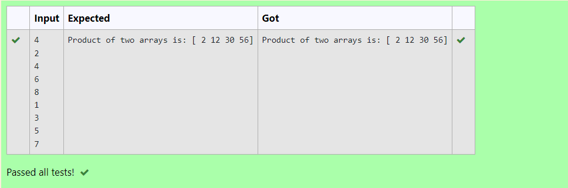

# Multiplying-two-matrix

## AIM:
To write a python program to multiply two arrays using numpy.
## ALGORITHM:

### Step 1:
Get the input from the user to know the dimensions of the matrix.
### Step 2:
Use iterations to get the user input into l1 and l2.
### Step 3:
Import numpy module.
### Step 4:
Use array function and pass the arguements as list.
### Step 5:
Multiply both the matrices and print the value.
## PROGRAM: 
```
n=int(input())

l1,l2=[],[]
for i in range(n):
    l1.append(int(input()))
for i in range(n):
    l2.append(int(input()))

import numpy as np
A=np.array(l1)
B=np.array(l2)
print("Product of two arrays is:",A*B)
```

## OUTPUT:


## RESULT:
Hence a python program is executed to multiply two arrays using numpy.

